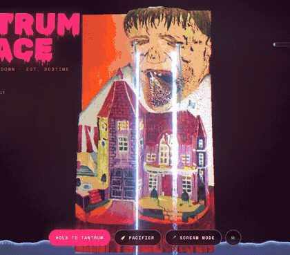
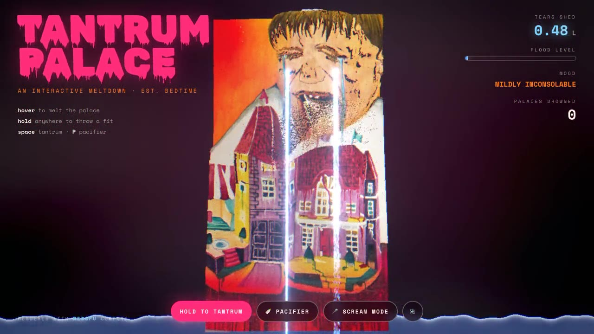
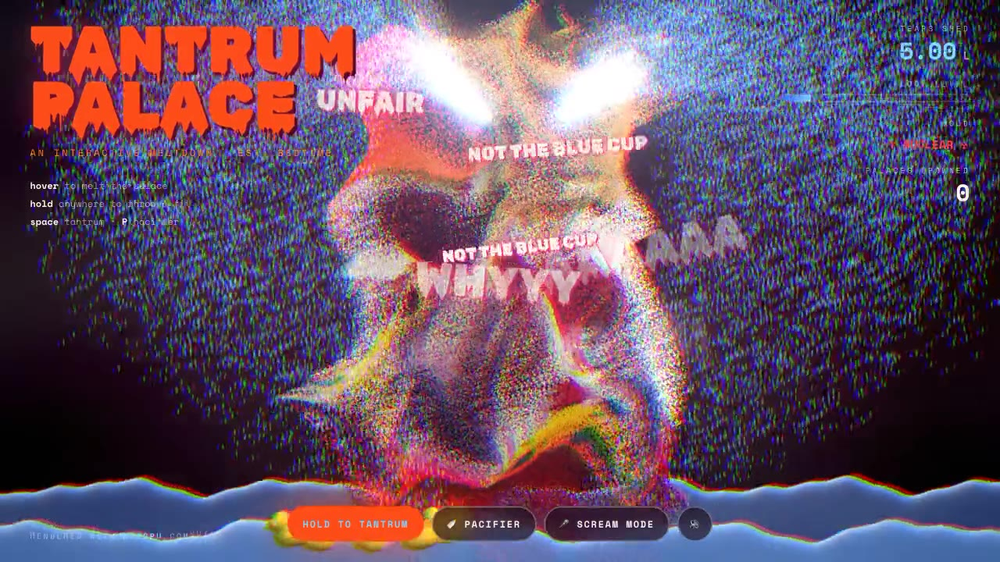
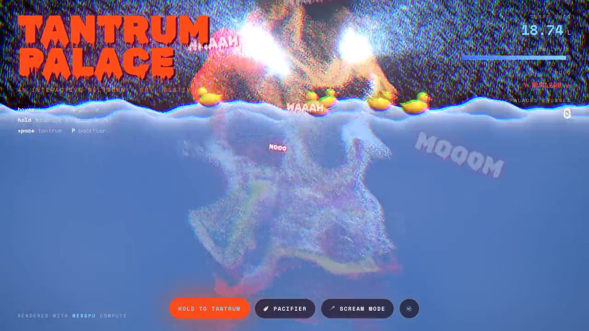
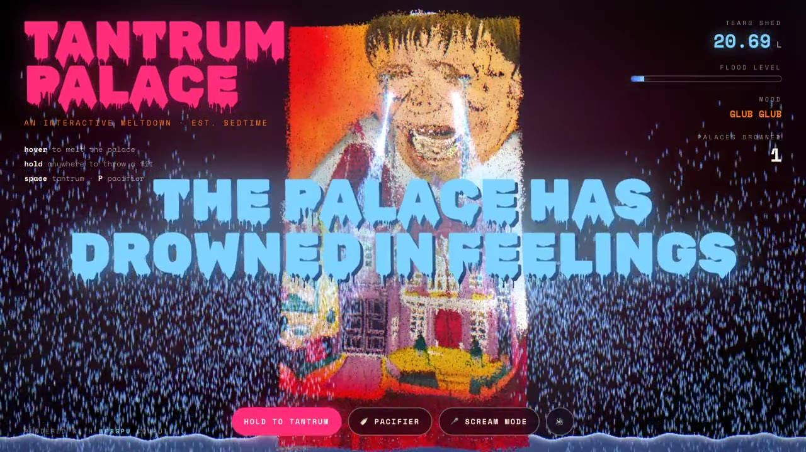
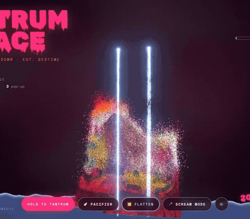
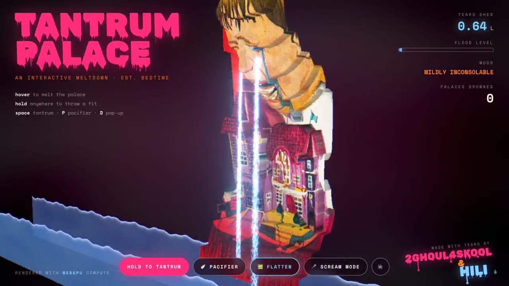

<div align="center">

# 😭 TANTRUM PALACE

### an interactive meltdown · est. bedtime

A hand-painted artwork of a crying kid and a dripping dollhouse, rebuilt as **~230,000 GPU particles**<br/>that melt under your cursor, explode when you throw a fit, and slowly drown in tears.

**[▶ Open the live site](https://hilimor.github.io/the-tantrum-palace/)** &nbsp;·&nbsp; **[🔊 Watch the demo with sound](media/demo.mp4)**




</div>

---

## The idea

The painting already looks mid-meltdown: tears running down, paint dripping off the rooftops, a toy palace that seems to be crying with its owner. **Tantrum Palace** takes that literally. Every pixel becomes a particle with its own physics, the tears never stop, and the room slowly fills up.

| Calm (for now) | Tantrum | The flood | Game over |
|:---:|:---:|:---:|:---:|
|  |  |  |  |
| The painting, rebuilt from particles, sobbing gently | Paint blasts out of the mouth, tears go full lawn-sprinkler | Everything underwater turns blue and wobbly. Rubber ducks arrive | *"The palace has drowned in feelings."* |

## 🎪 Pop-up diorama mode

Press **🎪 pop-up** (or **D**) and the painting folds flat, then unfolds like a pop-up book. The background stands up first, then the dollhouse, then the face. Move the mouse and the camera swings around a real 3D diorama.

<div align="center">

&nbsp;


**[🔊 Watch the diorama demo with sound](media/diorama.mp4)** &nbsp;·&nbsp; **[Open it straight in pop-up mode](https://hilimor.github.io/the-tantrum-palace/?diorama)**
</div>

The painting is still made of the original pixels, so from the front it looks exactly as painted. The depth comes from a **Depth Anything V2** map of the artwork, generated once offline and shipped as `public/depth.png`. It's partly snapped into terraces so the layers read like thick cardboard cut-outs. Wherever the depth drops sharply (the house outline, the edge of the face), extra shaded particles fill in the side walls, so the pieces look solid when you orbit.

## How to play

| Input | What happens |
|---|---|
| **Hover** | The paint melts and drips under your cursor, then crawls back home |
| **Hold** mouse / **Space** | Tantrum: shock-wave from the mouth, head-shaking, screen shake, chromatic split, synthesized *WAAAH* |
| **🍼 Pacifier** / **P** | *"shhh"*: the flood drains and the kid is soothed (temporarily) |
| **🎪 Pop-up** / **D** | Toggle the 3D pop-up diorama |
| **🎤 Scream mode** | Uses your microphone: actually scream at your computer to feed the tantrum |

The HUD keeps score: litres of tears shed, flood level, current mood (*mildly inconsolable → escalating → ☢ nuclear ☢ → glub glub*), and palaces drowned.

## How it works

**Painting → particles.** The image is sampled on a 360 × 640 grid. Each sample becomes a particle with a home position, a colour (converted to linear space) and a fake depth: the face bulges out as a dome, the dollhouse sits forward like a diorama and the orange backdrop is pushed back. That gives real parallax when the camera drifts with your mouse.

**WebGPU compute.** All particle state lives in GPU storage buffers (`instancedArray`) and is stepped every frame by compute shaders written in **TSL**, three.js's node-based shading language. Each painting particle combines:

- a spring back to its home position (weakened during a tantrum),
- a "sob" offset masked to the face, so the head heaves and shakes,
- a cursor force that pushes paint away and drags it downward (dripping),
- 3D noise turbulence scaled by tantrum intensity,
- a one-shot radial impulse from the mouth,
- buoyant wobble for anything below the water line.

**Tears** are a second compute system of 60k particles that respawn at the eyes. Calm tears dribble. Tantrum tears launch in ballistic arcs. They die when they hit the water, and the water level is what they feed.

**Rendering.** Particles are drawn as instanced billboards (`SpriteNodeMaterial`) that read positions directly from the storage buffers. There's no CPU round-trip. The flood is a displaced plane with animated waves and caustic noise. Post-processing runs through a `RenderPipeline`: bloom, then an RGB shift driven by tantrum intensity, then a vignette.

**Sound.** No audio files. The cry is a sawtooth oscillator with vibrato pushed through three band-pass filters tuned to the formants of an *"aaa"* vowel, with a pitch contour that loops *WAAH-aah-AAAH*. The pacifier is filtered noise and the drowning *glug* is a burst of rising sine blips.

## Run locally

```sh
npm install
npm run dev
```

Open the printed URL in a browser with **WebGPU** (Chrome, Edge, Safari 26+). Other browsers fall back to WebGL2 with fewer particles.

URL options: **`?diorama`** starts in pop-up mode. **`?demo`** plays the scripted ~26 s showreel performance, and **`?demo&diorama`** plays the diorama one.

## Project structure

```
index.html          page shell, HUD and controls
src/main.js         scene, compute shaders, post-processing, audio, interaction
src/style.css       dripping typography, HUD, WAAAH animations
public/painting.jpg the source artwork
public/depth.png    Depth Anything V2 depth map of the artwork
media/              demo video, GIF and stills
```

## Credits

Made with tears by **2ghoul4skool** & **Hili**.

Built with [three.js](https://threejs.org) (WebGPU renderer + TSL) and [Vite](https://vite.dev). Type: *Rubik Wet Paint* and *Space Mono* from Google Fonts.
